# PROJECT Report

Author: Mohammed Sohail Ahmed, Nandhini Gopalakrishnan

Date: 10-04-2024

1. Check [readme.txt](readme.txt) for lab work statement and self-evaluation.
2. Check [Steps.md](Steps.md) for Project Execution Steps

## Project Requirements (project)

### R1 Write a project proposal (2-3 pages).

Complete? Yes

If Yes, briefly describe:

1. what you have done,
   We built a “Movie Recommendation System” using the Java “Spring Boot” framework.
2. what are the new features.
   We have implemented three different models:
   1. Cosine Similarity
   2. KNN Algorithm along with Cosine Similarity
   3. Tf-Idf Similarity
3. Take some screen to demonstrate the features if applicable.
   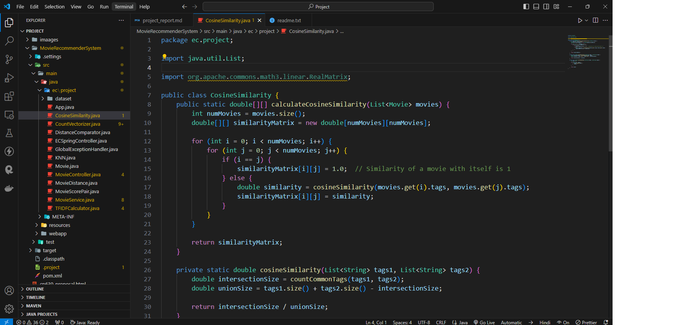{width=90%}
   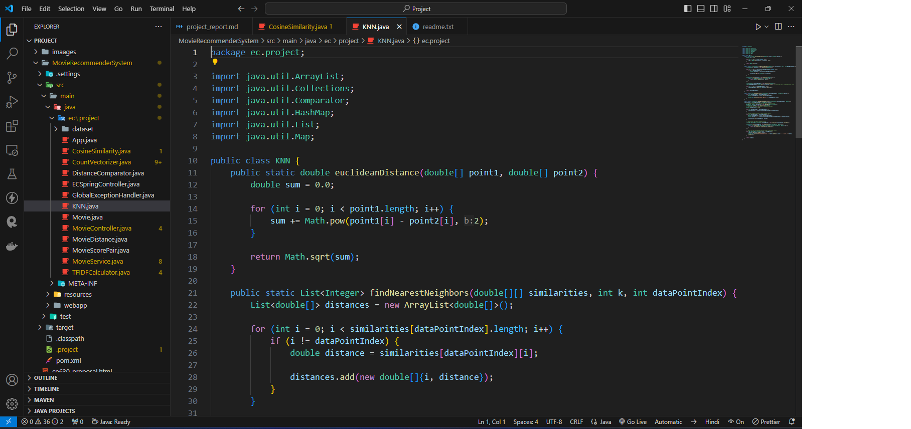{width=90%}
   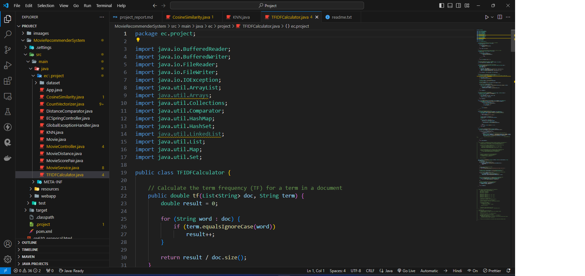{width=90%}

### R2 Design data format, collect data, create dataset for the application.

Complete? Yes

If Yes, briefly describe:

1. what you have done,
   We have utilized two distinct datasets. The first dataset, “tmdb_5000_credits.csv” includes movie ID, title, cast, and crew details. The second dataset, “tmdb_5000_movies.csv” comprises information such as movie ID, title, rating, vote count, average votes, etc. We merged these two datasets based on title column to create a new, comprehensive one. Then we cleaned the data to handle the missing values.
2. what are the new features.
   We have merged the two datasets and formed a new one. After data cleaning, we created a new column named “tags” which contains information from the overview, genres, cast, crew, and other similar columns.
3. Take some screen to demonstrate the features if applicable.
   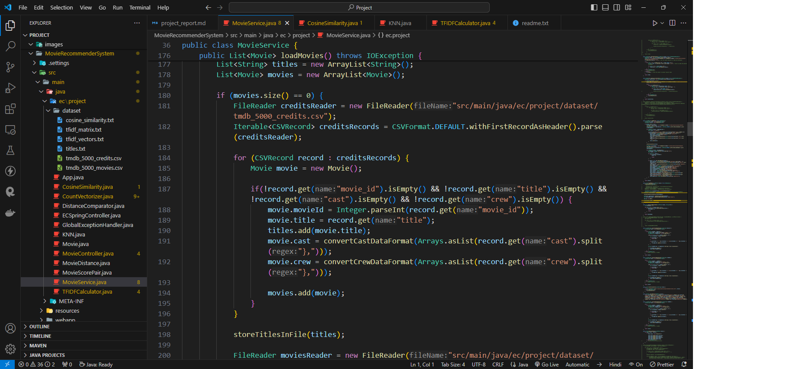{width=90%}
   {width=90%}
   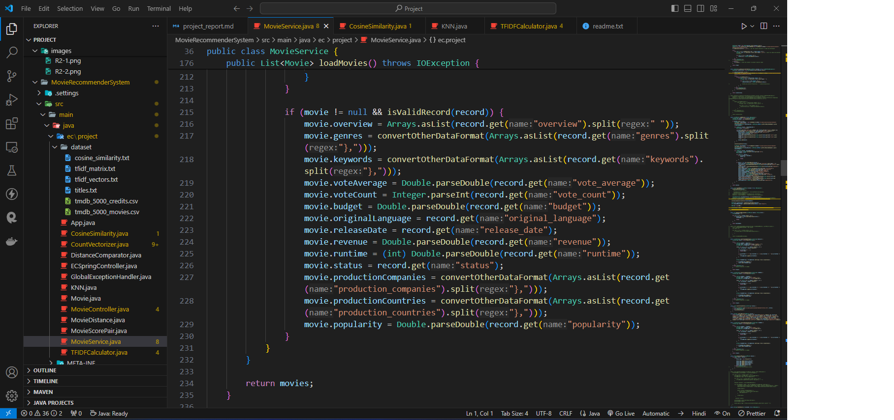{width=90%}
   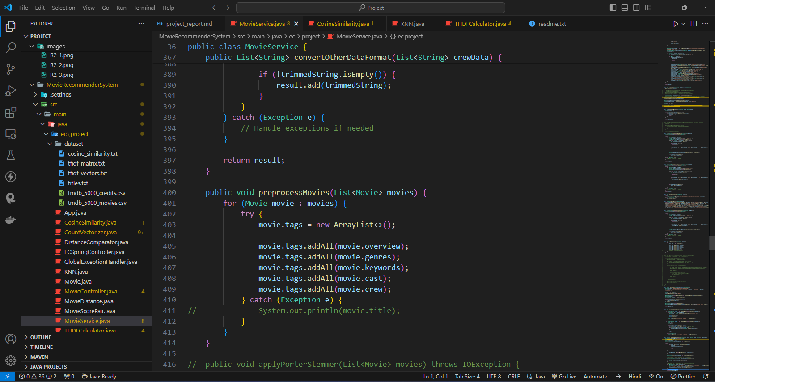{width=90%}

### R3 Develop and implement data application algorithms for the proposed application problem.

Complete? Yes

If Yes, briefly describe:

1. what you have done,
   We utilized three different algorithms to determine which one recommends the most similar movies.
2. what are the new features.
   1. In the Cosine Similarity algorithm, we utilized the “tags” feature column we created after cleaning the data to find the similarity between the movies.
   2. In the KNN algorithm, we employed the similarities from the “Cosine Similarity” algorithm to recommend similar movies.
   3. In the Tf-Idf Similarity algorithm, we used the “tags” feature column to calculate the tf-idf similarity score.
3. Take some screen to demonstrate the features if applicable.
   {width=90%}
   {width=90%}
   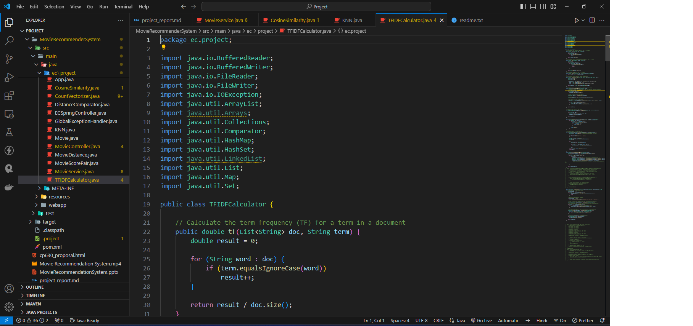{width=90%}

### R4 Do data computing to generate models, representing models in portable format and stored in file or database. More credit is given if distributed approach is used data mining of big dataset.

Complete? Yes

If Yes, briefly describe:

1. what you have done,
   As answered in question 3, we have calculated the similarity scores using “Cosine Similarity” and “Tf-Idf Similarity”. We trained the model once and have saved the results for future use.
2. what are the new features.
   We have saved the results of the “Cosine Similarity” model and the “Tf-Idf Similarity” model into files, which we are now using to make predictions.
3. Take some screen to demonstrate the features if applicable.
   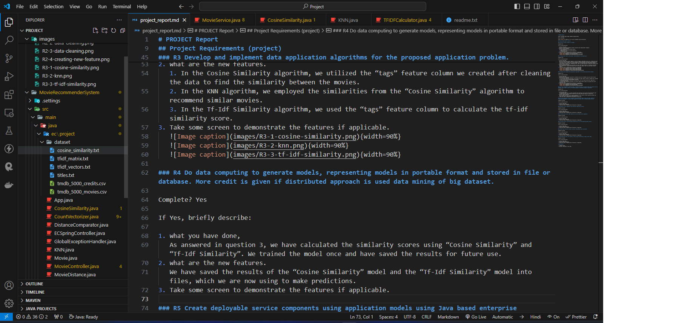{width=90%}

### R5 Create deployable service components using application models using Java based enterprise computing technologies, to create client program to do remote call of the data mining services.

Complete? Yes

If Yes, briefly describe:

1. what you have done,
   1. Deployed the application on an Apache Tomcat Server.
   2. Implemented features for recommending movies based on various algorithms (Cosine Similarity, KNN, and Tf-Idf).
   3. Trained models, calculated similarity scores, and provided movie recommendations.
2. what are the new features.
   1. The application recommends movies using Cosine Similarity, KNN, and Tf-Idf algorithms.
   2. Users can select a movie, and the system suggests similar movies based on their choice.
3. Take some screen to demonstrate the features if applicable.
   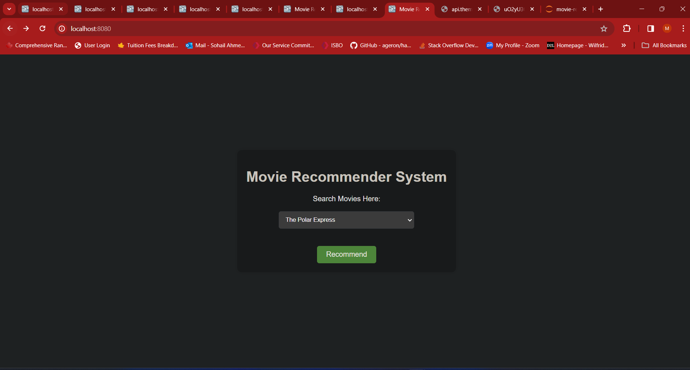{width=90%}
   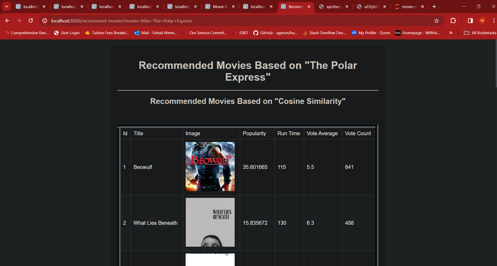{width=90%}
   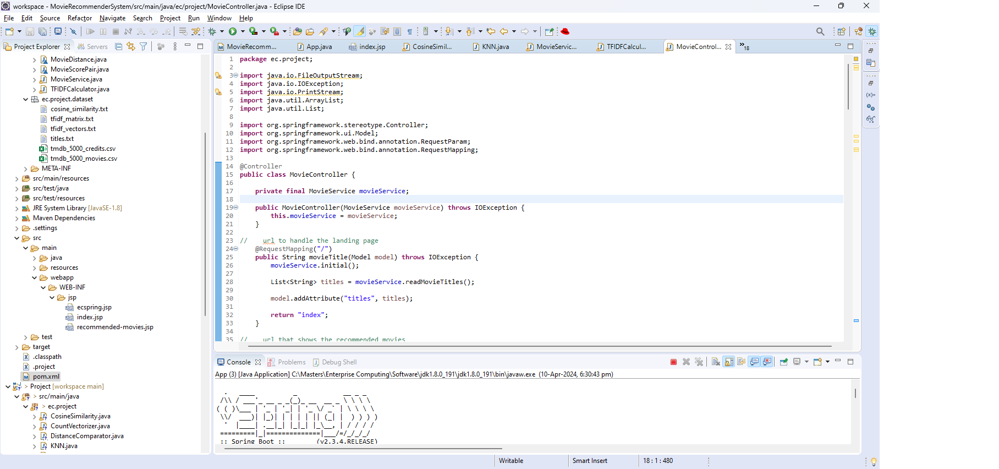{width=90%}
   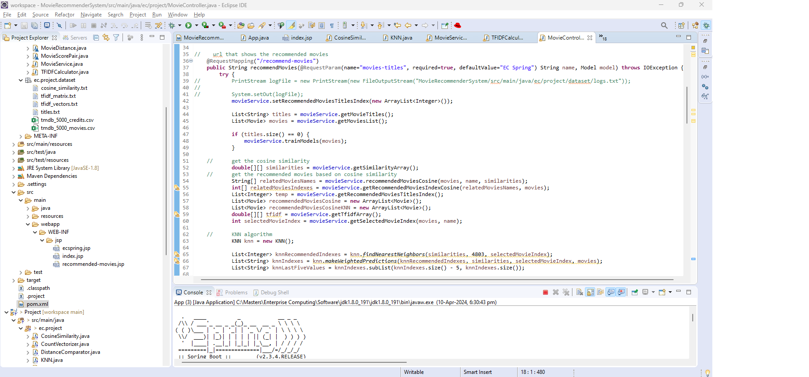{width=90%}

### R6 Deploy service components onto enterprise application servers.

Complete? Yes

If Yes, briefly describe:

1. what you have done,
   We have deployed our web application on "Apache Tomcat Server".
2. what are the new features.
   We have deployed our application on the “Apache Tomcat Server” because it’s lightweight, capable of handling Java Servlets and JavaServer Pages (JSP), and provides a ready-to-use server environment.
3. Take some screen to demonstrate the features if applicable.
   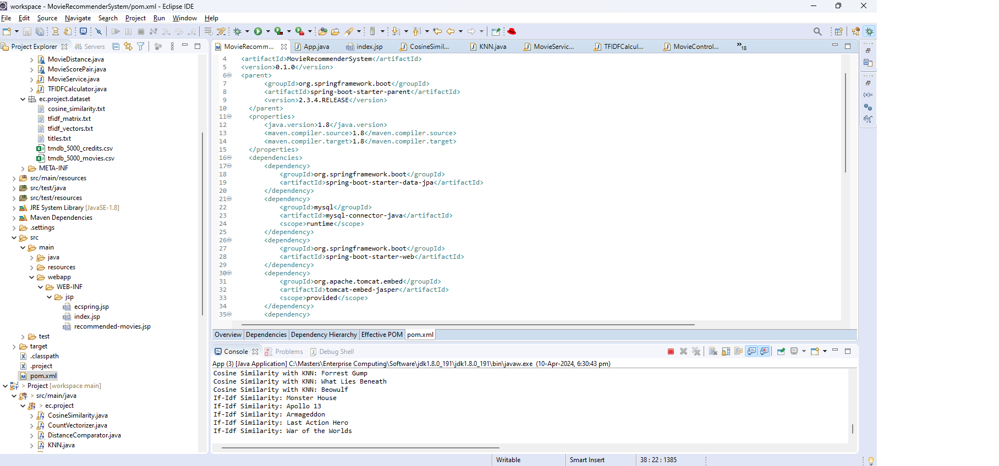{width=90%}
   {width=90%}

### R7 Create web services (SOAP, RESTful) to use the data service components.

Complete? Yes

If Yes, briefly describe:

1. what you have done,
   We have used "HTTP Requests & Responses".
2. what are the new features.
   We haven’t created any RESTful or SOAP services. Instead, we just focused on “HTTP Requests & Responses” to display recommended movies based on the selected movie. The only reason, why we have user "HTTP" inseard of reastful and soap services is because is "Simplicity & Lightweight", and "Ease of Integration".
3. Take some screen to demonstrate the features if applicable.
   {width=90%}
   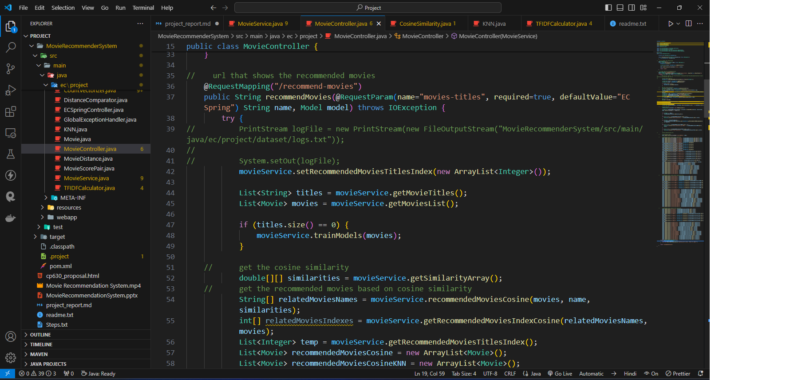{width=90%}

### R8 Create web user interface/mobile applications to use the application/web services.

Complete? Yes

If Yes, briefly describe:

1. what you have done,
   We build a web application.
2. what are the new features.
   We built a web application using the Java Spring Boot framework. The application includes a dropdown list where users can select any movie. When the user clicks the “Recommend” button, the application recommends similar movies based on the selected one. 🎥🔍
3. Take some screen to demonstrate the features if applicable.
   {width=90%}
   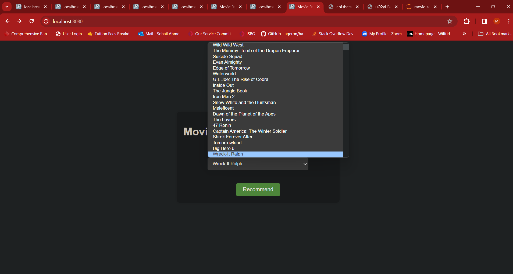{width=90%}
   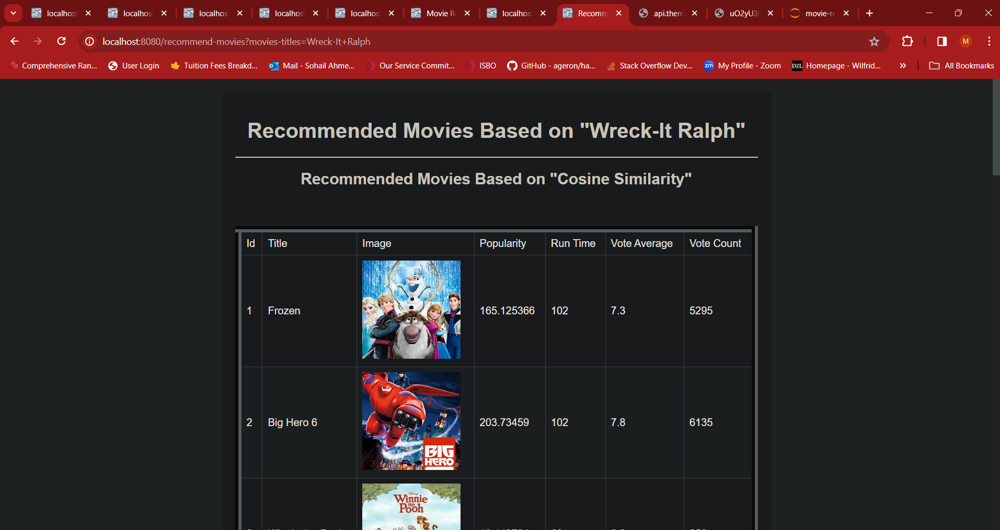{width=90%}

### R9 Test your services, log your services, and document your term project.

Complete? Yes

If Yes, briefly describe:

1. what you have done,
   We have tested the web application.
2. what are the new features.
   We have added the print statements to print the recommended movies and have verify that it matches with the on the web application.
3. Take some screen to demonstrate the features if applicable.
   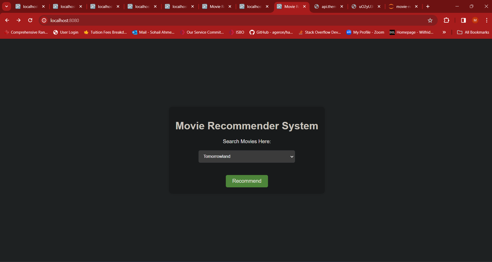{width=90%}
   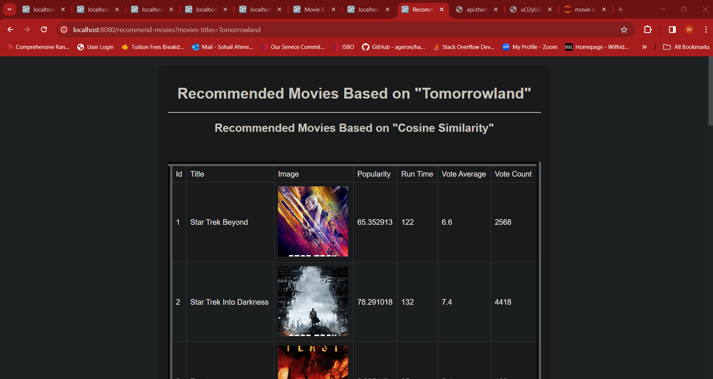{width=90%}
   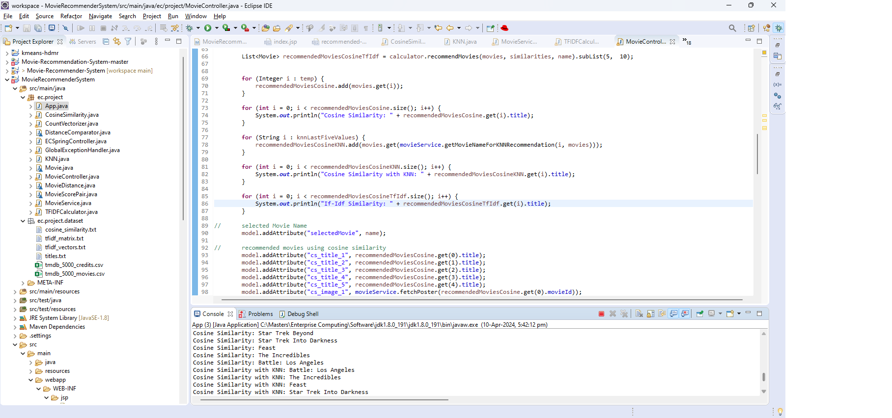{width=90%}

### R10 Demonstrate your term project in final project presentation, slides, short video.

Complete? Yes

If Yes, briefly describe:

1. what you have done,
   We have attached the following files:
   1. Presentation
   2. Video file
   3. Steps.txt file
   4. Screenshots
2. what are the new features.
   1. We have attached a presentation that provides a brief description of the project, the models we are using, and more.
   2. A video file demonstrating how the project works.
   3. A Steps.txt file containing a brief description of the project and instructions on how to run it.
   4. There is a folder named "images" which contains the images and screenshots of the project.
3. Take some screen to demonstrate the features if applicable.
   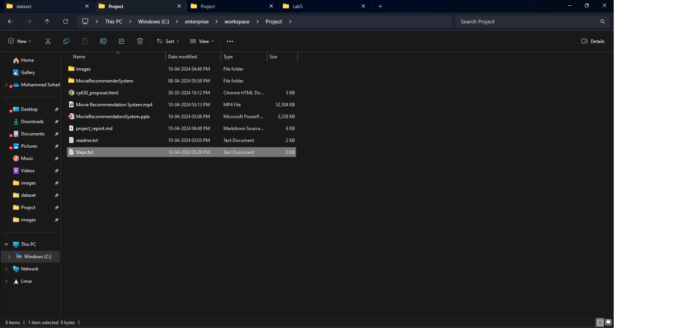{width=90%}

**References**

1. CP630OC project
2. Add your references if you used.

**Renerences Used**
Dataset source: Various sources, including Kaggle.
Java libraries: Weka API for machine learning, JDBC for database connectivity.
